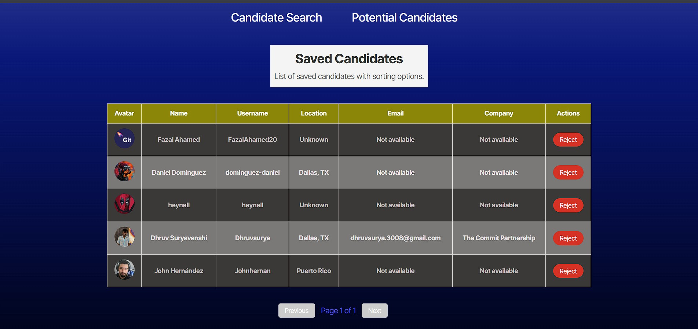

# Candidate Search

_A modern React app for searching, reviewing, and saving GitHub candidates._


**Live Demo:** [Candidate Search on Render](https://candidate-search-pdrr.onrender.com/)

> **Note:** The live demo relies on a GitHub API token, which may expire or hit rate limits. If you encounter errors or missing data, this is likely the cause.
---

## Table of Contents

- [Candidate Search](#candidate-search)
  - [Table of Contents](#table-of-contents)
  - [Description](#description)
  - [Features](#features)
  - [Prerequisites](#prerequisites)
  - [Technologies Used](#technologies-used)
  - [Quick Start](#quick-start)
  - [Installation](#installation)
  - [Usage](#usage)
  - [Screenshots](#screenshots)
    - [Main App](#main-app)
    - [Video Demo](#video-demo)
  - [License](#license)
  - [Contributing, Support, and FAQ](#contributing-support-and-faq)
  - [Acknowledgments](#acknowledgments)
  - [Author](#author)

---

## Description

**Candidate Search** is a React-based web application that allows users to search for GitHub users, review their profiles, and save potential candidates for future reference. The app features sorting, pagination, and persistent local storage for saved candidates.

---

## Features

-   Search GitHub users and view their profiles
-   Save candidates for future reference
-   Sort and paginate saved candidates
-   Responsive design for desktop and mobile
-   Local storage persistence

---

## Prerequisites

-   [Node.js](https://nodejs.org/) (v18 or higher)
-   [npm](https://www.npmjs.com/)
-   A GitHub personal access token ([create one here](https://github.com/settings/tokens))

---

## Technologies Used

-   [React](https://reactjs.org/)
-   [React Router](https://reactrouter.com/)
-   [Vite](https://vitejs.dev/)
-   [TypeScript](https://www.typescriptlang.org/)
-   [CSS](https://developer.mozilla.org/en-US/docs/Web/CSS)

---

## Quick Start

```bash
git clone https://github.com/your-username/Candidate-Search.git
cd Candidate-Search
npm install
```

---

## Installation

1. **Clone the repository:**

    ```bash
    git clone https://github.com/your-username/Candidate-Search.git
    cd Candidate-Search
    ```

2. **Install dependencies:**

    ```bash
    npm install
    ```

3. **Set up environment variables:**

    Create a `.env` file in the root directory:

    ```env
    VITE_GITHUB_TOKEN=your_github_personal_access_token
    ```

    > **Note:** Never commit your real `.env` file to version control.

4. **Start the development server:**

    ```bash
    npm run dev
    ```

    The app will be available at [http://localhost:5173](http://localhost:5173) by default.

---

## Usage

-   **Search Candidates:** Browse GitHub users and view their details.
-   **Save Candidates:** Click "Save" to add a candidate to your saved list.
-   **View Saved Candidates:** Go to the "Potential Candidates" section to view, sort, and manage your saved users.
-   **Sort & Paginate:** Use table headers and pagination controls to organize your saved candidates.

---

## Screenshots

### Main App



### Video Demo

[Watch the video demo](https://drive.google.com/file/d/1nEKjZC-Iqtj6MZ7Iryw2j6tCbYoV_x2Y/view?usp=sharing)

---

## License

This project is licensed under the [MIT License](./LICENSE.txt).

You are free to use, modify, and distribute this software for personal or commercial purposes, provided you include the original copyright
and license notice in any copies or substantial portions of the software.

See the [MIT License text](https://opensource.org/licenses/MIT) for full details.

---

## Contributing, Support, and FAQ

-   **Contributions:** Pull requests are welcome! Please open an issue or submit a pull request for improvements or bug fixes.
-   **Support:** If you encounter any issues or have suggestions, please open an issue on GitHub.
-   **FAQ:**
    -   _How do I run the program?_
        See the [Installation](#installation) and [Usage](#usage) sections above.
    -   _Can I use this for my own project?_
        Yes, this project is MIT licensed. See the [License](#license) section.
    -   _I'm having trouble with the GitHub API or running the app!_
        -   Double-check your `.env` file value for `VITE_GITHUB_TOKEN`.
        -   Make sure your token is valid and has the correct permissions.
        -   Try running `npm install` if you see missing module errors.

---

## Acknowledgments

Portions of this project were developed using starter code provided by [edX Boot Camps LLC](https://bootcamp.edx.org/) for educational purposes.

---

## Author

Created by Sharon Heim.
For questions or suggestions, please visit my [GitHub profile](https://github.com/heimsharon).

---

© 2025 Candidate Search Project
